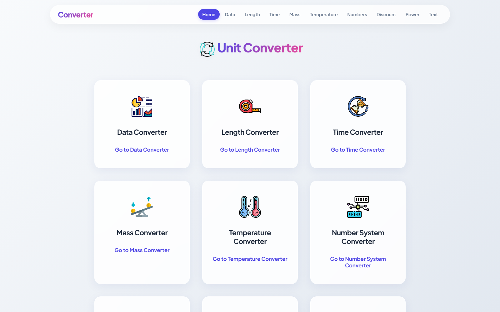
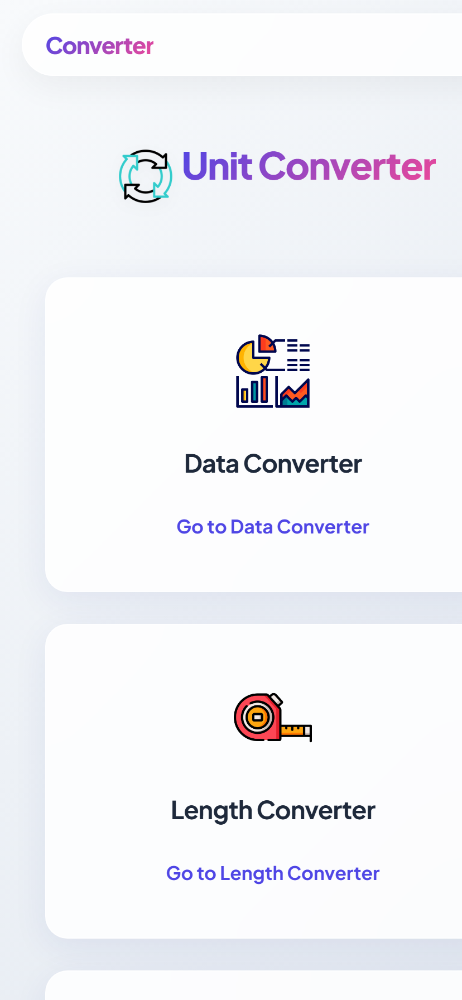

# All Unit Converter

**Fast, real-time unit conversion for everything that has a number in it.**

Convert length, mass, temperature, time, data, number systems, power, discount, and text - all in one clean, responsive web app. No installs, no plugins, no math homework required. Just type and watch the answers appear.

## Screenshots

<p align="center">
  
</p>

<p align="center">
  
</p>

## Live Demo

Try it live: [All Unit Converter](https://allunitconverter.netlify.app)

Works as an installable PWA - add it to your home screen and use it offline.

## Converters

| Converter | What it does |
| --- | --- |
| [Length](length.html) | Meters, kilometers, inches, feet, miles and more |
| [Mass](mass.html) | Kilograms, grams, pounds, ounces and more |
| [Temperature](temperature.html) | Celsius, Fahrenheit, Kelvin and more |
| [Time](time.html) | Seconds, minutes, hours, days and more |
| [Data](data.html) | Bytes, kilobytes, megabytes, gigabytes and more |
| [Number System](numbersystem.html) | Decimal, binary, octal, hexadecimal and more |
| [Discount](discount.html) | Find discounted prices and savings in seconds |
| [Power](power.html) | Power and energy calculations made easy |
| [Text](text.html) | A handy text editor and counter |

## Features

- **Instant conversion** - results update in real time as you type
- **Wide unit coverage** - nine converters under one roof
- **Clean, modern UI** - glass-morphism design that looks good on any screen
- **Fully responsive** - mobile, tablet, and desktop friendly
- **PWA ready** - installable and works offline via service worker
- **Zero dependencies** - pure HTML, CSS, and JavaScript, no build step

## Tech Stack

- **HTML** - structure
- **CSS** - modern styling with CSS variables and glass effects
- **JavaScript** - all conversion logic, navigation, and PWA features
- **Service Worker** - offline support and caching
- **Netlify** - hosting, redirects, and deployment

## Getting Started

This is a static site. No build step, no package manager, no server needed.

**Option 1:** Open `index.html` directly in any browser.

**Option 2:** Run a local server:

```bash
python -m http.server 8000
```

Then open [http://localhost:8000](http://localhost:8000).

## Project Structure

```
.
|-- assets/          Icons, images, and social assets
|-- images/          Page images and Open Graph images
|-- screenshots/     README screenshots
|-- about.html       About page
|-- contact.html     Contact page
|-- data.html        Data converter
|-- discount.html    Discount calculator
|-- index.html       Home / converter hub
|-- length.html      Length converter
|-- mass.html        Mass converter
|-- numbersystem.html  Number system converter
|-- power.html       Power calculator
|-- privacy.html     Privacy policy
|-- sw.js            Service worker (PWA offline support)
|-- manifest.json    PWA manifest
|-- styles.css       Main stylesheet
|-- nav.js           Navigation and PWA install logic
```

## Contact

**Arun Neupane** - Frontend Developer, CTO and Lead Architect.

**"I like to code till I don't like to code. (It never happens.)"**

### Connect with Me

- **Website:** [arunneupane.vercel.app](https://arunneupane.vercel.app)
- **GitHub:** [github.com/arundada9000](https://github.com/arundada9000)
- **LinkedIn:** [linkedin.com/in/arundada9000](https://www.linkedin.com/in/arundada9000)
- **X / Twitter:** [x.com/arundada9000](https://x.com/arundada9000)
- **YouTube:** [youtube.com/@arundada9000](https://youtube.com/@arundada9000)
- **Instagram:** [instagram.com/arundada9000](https://instagram.com/arundada9000)
- **Facebook:** [facebook.com/arundada9000](https://facebook.com/arundada9000)
- **Phone / WhatsApp:** [+977 9811420975](https://wa.me/9779811420975)
- **Email:** [arunneupane0000@gmail.com](mailto:arunneupane0000@gmail.com)

Open to collaboration, coding discussions, projects, or just a friendly hello.

## Contributing

This project is proprietary software. Please read [CONTRIBUTING.md](CONTRIBUTING.md) before doing anything.

## Security

Found a vulnerability? Please read [SECURITY.md](SECURITY.md) and report it privately - do not open a public issue.

## License

All rights reserved. This project is **not free for use** and every use requires explicit written permission from the copyright holder. See [LICENSE](LICENSE) for full terms.

---

*The only conversion that never fails: effort into results.*

*Converts every unit. Except the one for love. And money. Working on it.*

*Measure twice, convert once.*

---

**Built by Arun Neupane - © 2026 All Rights Reserved**
