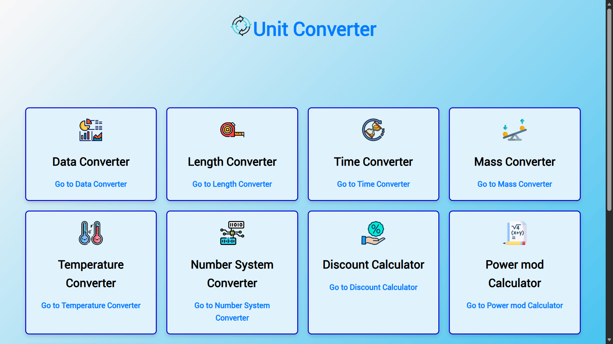
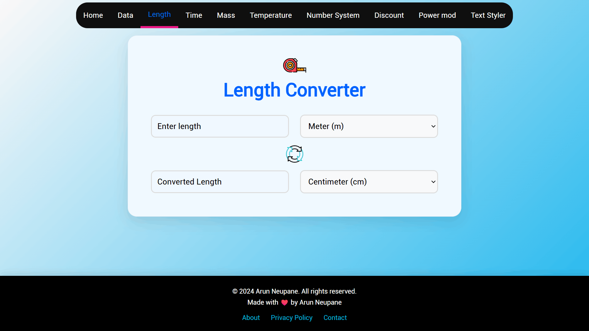
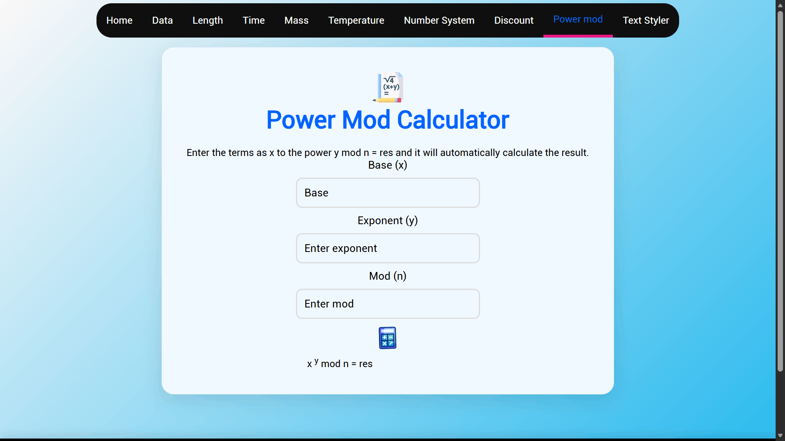
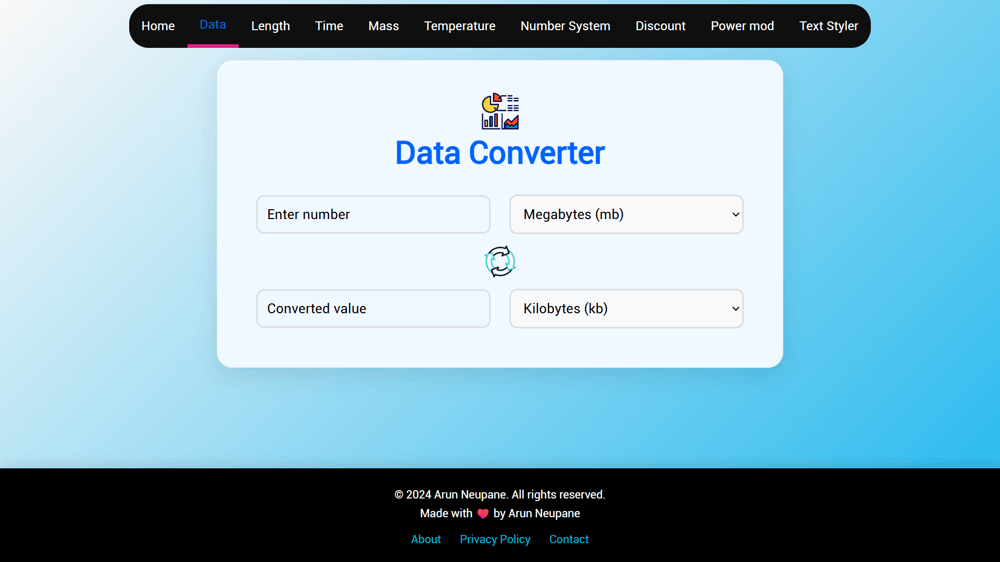
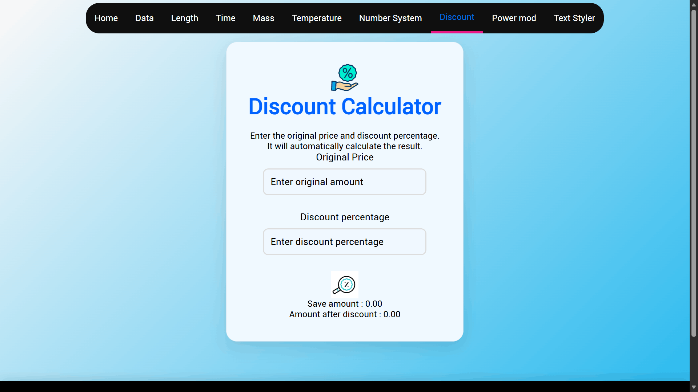
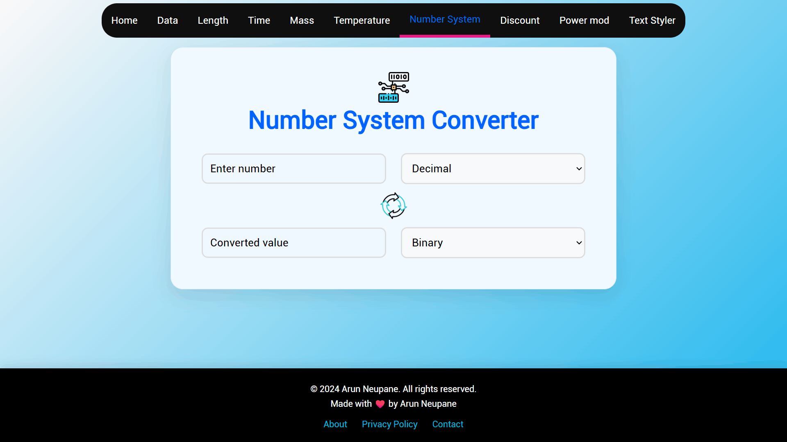
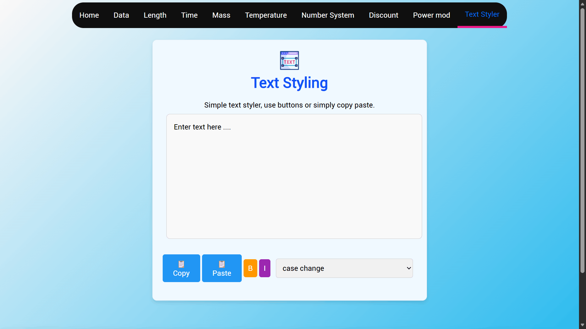
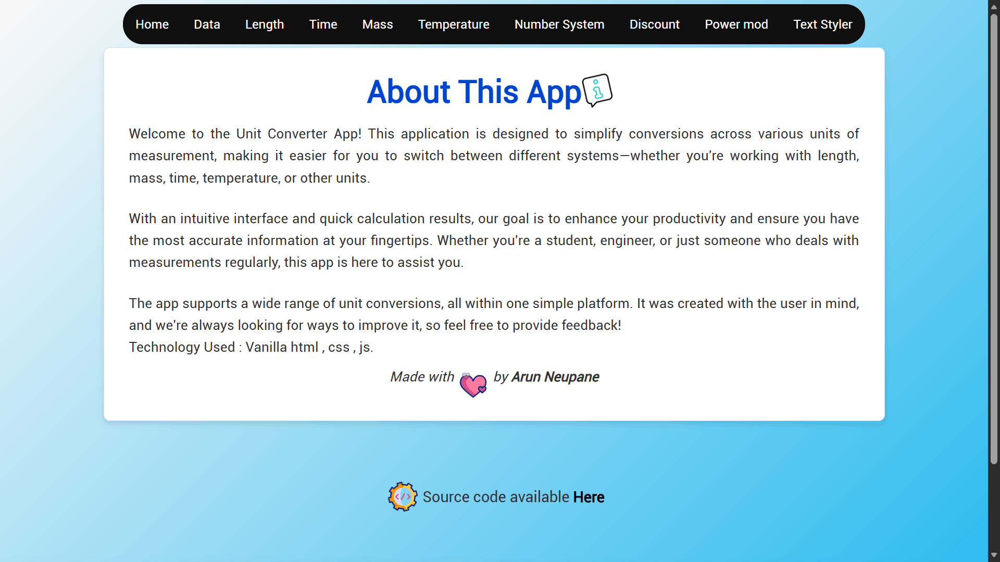
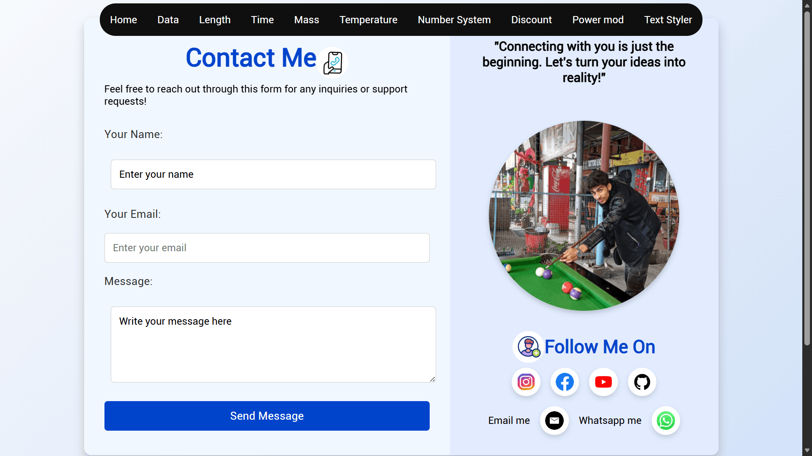
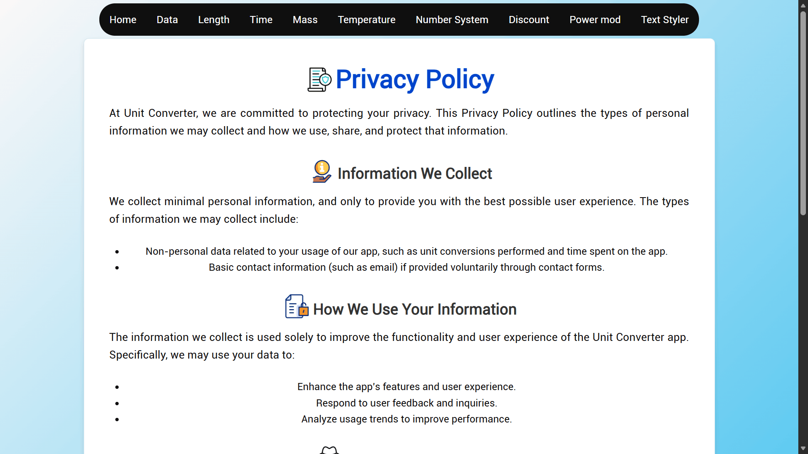

# All Unit Converter

Welcome to **All Unit Converter**! This is a simple, real-time, user-friendly tool that allows you to convert between various units seamlessly. Whether you need to convert between units of length, weight, temperature, or more, **All Unit Converter** has got you covered.

---

## Features

- **Instant Conversion:** Real-time results as you type.
- **Wide Range of Units:** Convert between a variety of units like:
  - Length (meters, kilometers, inches, feet, etc.)
  - Weight (kilograms, grams, pounds, ounces, etc.)
  - Temperature (Celsius, Fahrenheit, Kelvin)
  - Power, Time and more!
- **Clean & Simple UI:** Easy-to-use interface with a modern and minimalist design.
- **Responsive Design:** Works seamlessly across desktops, tablets, and mobile devices.

---

## Live Demo

Try out the live version of the Unit Converter here: [All Unit Converter](https://allunitconverter.netlify.app)

---

---

##  Tech Stack

**All Unit Converter** is built with the following technologies:

- **Frontend:**
  - HTML
  - CSS
  - JavaScript

---

## Contributing

If you want to contribute, feel free to fork the repository, make changes, and submit a pull request. Here’s how you can contribute:

1. Fork the repo to your GitHub account.
2. Create a new branch for your changes (`git checkout -b feature-name`).
3. Commit your changes (`git commit -am 'Add new feature'`).
4. Push your changes to the branch (`git push origin feature-name`).
5. Open a pull request and let me know what you've changed!

---

## Contact Me

Hello!   
I’m **Arun Neupane** from **Nepal **.  
Open to collaboration, coding discussions, projects, or just a friendly hello.

---

### Connect with Me

---

**Location:** Nepal  
_Let’s build something awesome together!_

---

_Thank you for checking out **All Unit Converter**! I hope it makes your conversions easy and efficient!_ 
---

## License

This project is for educational and personal learning purposes only. Commercial use, public deployment, or any revenue-generating use requires explicit written permission from the author. See [LICENSE](LICENSE) for details.
